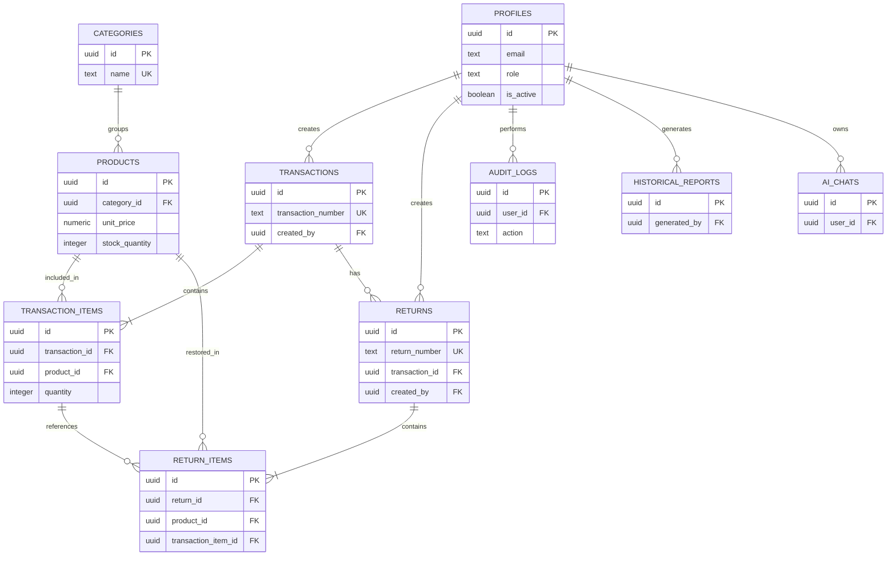
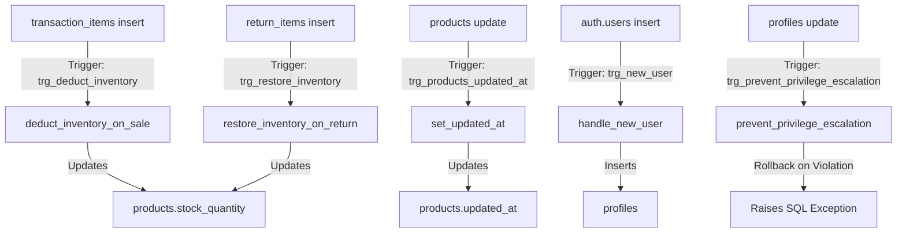

# MiniConstruct System: Database Data Dictionary

This document serves as the official **Data Dictionary** for the **MiniConstruct System**. It details the relational database schema hosted on Supabase (PostgreSQL), including tables, fields, constraints, relationships, custom PL/pgSQL functions, and triggers.

---

## 1. Entity-Relationship Diagram (ERD)

The diagram below illustrates the logical relationships and foreign key mappings between the system's ten main tables.

---

## 2. Table Definitions

### 2.1. `profiles`
Stores user profile metadata synced from Supabase Auth (`auth.users`), managing role-based privileges and account activation states.

| Column Name | Data Type | Nullable | Default | Key / Constraints | Description / Business Rules |
| :--- | :--- | :---: | :--- | :--- | :--- |
| `id` | `UUID` | No | *None* | **PK**, FK to `auth.users.id` (Cascade) | Unique identifier linking to Supabase system auth. |
| `full_name` | `TEXT` | No | `''` | *None* | The full name of the user (owner, admin, or staff). |
| `role` | `TEXT` | No | `'staff'` | Check: `role IN ('owner', 'admin', 'staff')` | Determines application permissions. |
| `email` | `TEXT` | Yes | *Null* | *None* | User email address, synchronized from auth schema. |
| `is_active` | `BOOLEAN` | No | `true` | *None* | State flag. Active users can log in; deactivated users are blocked. |
| `created_at` | `TIMESTAMPTZ` | No | `NOW()` | *None* | Timestamp of profile registration. |

---

### 2.2. `categories`
Maintains structural groupings of inventory products.

| Column Name | Data Type | Nullable | Default | Key / Constraints | Description / Business Rules |
| :--- | :--- | :---: | :--- | :--- | :--- |
| `id` | `UUID` | No | `gen_random_uuid()` | **PK** | Unique identifier for the product category. |
| `name` | `TEXT` | No | *None* | **UNIQUE** | Descriptive category name (e.g., "Steel", "Cement"). |
| `description`| `TEXT` | Yes | `''` | *None* | Optional summary of items classified under this category. |
| `created_at` | `TIMESTAMPTZ` | No | `NOW()` | *None* | Timestamp of category creation. |

---

### 2.3. `products`
The core catalog of construction supplies and inventory quantities.

| Column Name | Data Type | Nullable | Default | Key / Constraints | Description / Business Rules |
| :--- | :--- | :---: | :--- | :--- | :--- |
| `id` | `UUID` | No | `gen_random_uuid()` | **PK** | Unique identifier for the product. |
| `name` | `TEXT` | No | *None* | *None* | The commercial name of the material (e.g., "Plywood 3/4"). |
| `description`| `TEXT` | Yes | `''` | *None* | Additional attributes, manufacturer, or dimensions. |
| `category_id`| `UUID` | Yes | *Null* | FK to `categories.id` (Set Null) | Groups product; set null if category is deleted. |
| `unit` | `TEXT` | No | `'pcs'` | *None* | Unit of measurement (e.g., `pcs`, `bags`, `meters`). |
| `unit_price` | `NUMERIC(12,2)`| No | `0.00` | *None* | Retail selling price per unit. Must be $\ge 0$. |
| `stock_quantity`| `INTEGER` | No | `0` | *None* | Current count of items physically in stock. |
| `reorder_level`| `INTEGER` | No | `10` | *None* | Stock threshold. Warnings trigger when stock $\le$ level. |
| `created_at` | `TIMESTAMPTZ` | No | `NOW()` | *None* | Timestamp of record creation. |
| `updated_at` | `TIMESTAMPTZ` | No | `NOW()` | *None* | Timestamp of last modification (auto-updated by trigger). |

---

### 2.4. `transactions`
The sales ledger header, representing an individual Point of Sale checkout.

| Column Name | Data Type | Nullable | Default | Key / Constraints | Description / Business Rules |
| :--- | :--- | :---: | :--- | :--- | :--- |
| `id` | `UUID` | No | `gen_random_uuid()` | **PK** | Unique identifier for the transaction. |
| `transaction_number`| `TEXT`| No | *None* | **UNIQUE** | Custom key: `TXN-YYYYMMDD-XXXX` (daily reset). |
| `customer_name`| `TEXT` | No | `'Walk-in Customer'`| *None* | Purchaser name, defaults if none is provided. |
| `transaction_date`| `TIMESTAMPTZ`| No | `NOW()` | *None* | The physical date and time of purchase. |
| `total_amount`| `NUMERIC(12,2)`| No | `0.00` | *None* | Gross checkout price (sum of item subtotals). |
| `status` | `TEXT` | No | `'completed'` | Check: `status IN ('completed', 'partially_returned', 'fully_returned')` | Status tracks return history. |
| `created_by` | `UUID` | Yes | *Null* | FK to `profiles.id` (Set Null) | Identifies the clerk/admin who processed the sale. |
| `created_at` | `TIMESTAMPTZ` | No | `NOW()` | *None* | Audit timestamp of ledger entry creation. |

---

### 2.5. `transaction_items`
Lines within each transaction, representing specific products and quantities sold.

| Column Name | Data Type | Nullable | Default | Key / Constraints | Description / Business Rules |
| :--- | :--- | :---: | :--- | :--- | :--- |
| `id` | `UUID` | No | `gen_random_uuid()` | **PK** | Unique line-item identifier. |
| `transaction_id`| `UUID` | No | *None* | FK to `transactions.id` (Cascade) | Relates line items to their parent transaction header. |
| `product_id` | `UUID` | No | *None* | FK to `products.id` (Restrict) | Relates line to products. Deleting product is blocked. |
| `quantity` | `INTEGER` | No | `1` | *None* | Number of items purchased. Triggers stock deduction. |
| `unit_price` | `NUMERIC(12,2)`| No | `0.00` | *None* | Selling price at checkout, capturing historical cost. |
| `subtotal` | `NUMERIC(12,2)`| No | `0.00` | *None* | Calculated field: `quantity * unit_price`. |

---

### 2.6. `returns`
The return ledger header, tracking refunds and product returns.

| Column Name | Data Type | Nullable | Default | Key / Constraints | Description / Business Rules |
| :--- | :--- | :---: | :--- | :--- | :--- |
| `id` | `UUID` | No | `gen_random_uuid()` | **PK** | Unique identifier for the return sheet. |
| `return_number`| `TEXT` | No | *None* | **UNIQUE** | Custom key: `RTN-YYYYMMDD-XXXX` (daily reset). |
| `transaction_id`| `UUID` | No | *None* | FK to `transactions.id` (Restrict)| Links return to parent transaction. Deleting transaction blocked.|
| `reason` | `TEXT` | Yes | `''` | *None* | Staff comments describing return cause (e.g., "Defective"). |
| `total_refund`| `NUMERIC(12,2)`| No | `0.00` | *None* | Cumulative credit refund issued to the customer. |
| `created_by` | `UUID` | Yes | *Null* | FK to `profiles.id` (Set Null) | Identifies clerk/admin logging the return. |
| `created_at` | `TIMESTAMPTZ` | No | `NOW()` | *None* | Audit timestamp of return processing. |

---

### 2.7. `return_items`
Lines within each return sheet, representing specific products and quantities returned.

| Column Name | Data Type | Nullable | Default | Key / Constraints | Description / Business Rules |
| :--- | :--- | :---: | :--- | :--- | :--- |
| `id` | `UUID` | No | `gen_random_uuid()` | **PK** | Unique return line-item identifier. |
| `return_id` | `UUID` | No | *None* | FK to `returns.id` (Cascade) | Relates line items to their parent return header. |
| `product_id` | `UUID` | No | *None* | FK to `products.id` (Restrict) | Relates line to products. Deleting product is blocked. |
| `transaction_item_id`| `UUID`| Yes| *Null* | FK to `transaction_items.id` (Set Null) | Links back to original sale line item for verification. |
| `quantity` | `INTEGER` | No | `1` | *None* | Number of items returned. Triggers stock restoration. |
| `refund_amount`| `NUMERIC(12,2)`| No| `0.00` | *None* | Refunded amount for this specific line: `qty * original price`. |

---

### 2.8. `audit_logs`
Chronological logging of critical system interactions.

| Column Name | Data Type | Nullable | Default | Key / Constraints | Description / Business Rules |
| :--- | :--- | :---: | :--- | :--- | :--- |
| `id` | `UUID` | No | `gen_random_uuid()` | **PK** | Unique identifier for the audit log entry. |
| `user_id` | `UUID` | Yes | *Null* | FK to `profiles.id` (Set Null) | The user who triggered the event. |
| `action` | `TEXT` | No | *None* | *None* | Action name (e.g. `LOGIN`, `DELETE_PRODUCT`, `UPDATE_ROLE`). |
| `table_name` | `TEXT` | Yes | `''` | *None* | The database table affected by this action. |
| `record_id` | `TEXT` | Yes | `''` | *None* | The alphanumeric ID of the primary affected record. |
| `details` | `JSONB` | Yes | `'{}'` | *None* | Extensible before-and-after key-value details. |
| `created_at` | `TIMESTAMPTZ` | No | `NOW()` | *None* | The exact timestamp when the event occurred. |

---

### 2.9. `historical_reports`
Stores aggregated report summaries computed on the server.

| Column Name | Data Type | Nullable | Default | Key / Constraints | Description / Business Rules |
| :--- | :--- | :---: | :--- | :--- | :--- |
| `id` | `UUID` | No | `gen_random_uuid()` | **PK** | Unique identifier for the historical report. |
| `report_type`| `TEXT` | No | *None* | Check: `report_type IN ('daily', 'weekly', 'monthly', 'yearly')` | The period length of the report. |
| `period_label`| `TEXT` | No | *None* | *None* | Human-friendly range label (e.g. "June 2026"). |
| `period_start`| `TIMESTAMPTZ`| No | *None* | *None* | The starting date-time threshold. |
| `period_end` | `TIMESTAMPTZ`| No | *None* | *None* | The ending date-time threshold. |
| `total_sales` | `NUMERIC` | No | `0` | *None* | Total revenue generated during this window. |
| `total_transactions`| `INTEGER`| No | `0` | *None* | Total transactions finalized in this window. |
| `inventory_changes`| `JSONB`| Yes | `'[]'::jsonb` | *None* | Structured list of product restocks and sales deductions. |
| `user_activities`| `JSONB` | Yes | `'[]'::jsonb` | *None* | Aggregated activity frequency of users in the system. |
| `audit_summary`| `JSONB` | Yes | `'[]'::jsonb` | *None* | Key events from audit logs within this timeframe. |
| `generated_by`| `UUID` | Yes | *Null* | FK to `profiles.id` | The admin/owner who compiled the report. |
| `created_at` | `TIMESTAMPTZ`| Yes | `NOW()` | *None* | Timestamp when the report was generated. |

---

### 2.10. `ai_chats`
Saves persistent chat history for the streaming AI Assistant.

| Column Name | Data Type | Nullable | Default | Key / Constraints | Description / Business Rules |
| :--- | :--- | :---: | :--- | :--- | :--- |
| `id` | `UUID` | No | `gen_random_uuid()` | **PK** | Unique identifier for the chat session. |
| `user_id` | `UUID` | Yes | *Null* | FK to `profiles.id` (Cascade) | Relates the chat history to a specific user. |
| `title` | `TEXT` | No | *None* | *None* | Auto-generated or user-assigned chat title. |
| `messages` | `JSONB` | No | `'[]'::jsonb` | *None* | Structured array of messages: `[{role: 'user'|'assistant', content: '...'}]`. |
| `created_at` | `TIMESTAMPTZ`| Yes | `NOW()` | *None* | The timestamp the chat session was initiated. |
| `updated_at` | `TIMESTAMPTZ`| Yes | `NOW()` | *None* | The timestamp of the last message in this session. |

---

## 3. Database Triggers & Custom Functions

The system embeds crucial business rules and automation directly into the database engine using PostgreSQL triggers and PL/pgSQL functions.

### 3.1. Triggers

- **`trg_products_updated_at`**
  - **Table**: `products`
  - **Timing**: `BEFORE UPDATE`
  - **Function**: `set_updated_at()`
  - **Purpose**: Automatically synchronizes the `updated_at` column to `NOW()` when any field in the product row is edited.
- **`trg_new_user`**
  - **Table**: `auth.users`
  - **Timing**: `AFTER INSERT`
  - **Function**: `handle_new_user()`
  - **Purpose**: Automates profile creation by creating a public profile row containing the newly registered user's email and name. The default role assigned is `'staff'`.
- **`trg_deduct_inventory`**
  - **Table**: `transaction_items`
  - **Timing**: `AFTER INSERT`
  - **Function**: `deduct_inventory_on_sale()`
  - **Purpose**: Automatically deducts the purchased `quantity` from `products.stock_quantity`.
- **`trg_restore_inventory`**
  - **Table**: `return_items`
  - **Timing**: `AFTER INSERT`
  - **Function**: `restore_inventory_on_return()`
  - **Purpose**: Automatically adds the returned `quantity` back into `products.stock_quantity`.
- **`trg_prevent_privilege_escalation`**
  - **Table**: `profiles`
  - **Timing**: `BEFORE UPDATE`
  - **Function**: `prevent_privilege_escalation()`
  - **Purpose**: Restricts privilege editing. If a caller is not an `owner` or `admin`, any changes to a profile's `role` or `is_active` fields trigger an SQL Exception and rollback the transaction.

---

### 3.2. Custom PL/pgSQL Functions

- **`get_my_role() RETURNS TEXT`**
  - Returns the role string of the currently authenticated user (`auth.uid()`).
  - Marked as `STABLE` for optimal query execution.
- **`is_owner() RETURNS BOOLEAN`**
  - Returns `true` if the currently authenticated user has an active profile with either the `owner` or `admin` role.
- **`generate_transaction_number() RETURNS TEXT`**
  - Generates serial numbers based on the local time zone (`Asia/Manila` / UTC+8).
  - Structure: `'TXN-' || TO_CHAR(NOW(), 'YYYYMMDD') || '-' || LPAD(count+1, 4, '0')`
- **`generate_return_number() RETURNS TEXT`**
  - Generates daily sequential refund receipts.
  - Structure: `'RTN-' || TO_CHAR(NOW(), 'YYYYMMDD') || '-' || LPAD(count+1, 4, '0')`

---

## 4. Real-time Tables & Policies Summary

### 4.1. Supabase Realtime Replication
The database enables real-time message broadcasting for three high-concurrency tables:
1. `products` (instantaneous low-stock warnings and level sync)
2. `transactions` (real-time notification of checkouts)
3. `audit_logs` (live streaming of user events for admins)
4. `historical_reports` (instant notice when server-side report compilation completes)
5. `ai_chats` (live sync of conversation histories across open client instances)

### 4.2. Row Level Security (RLS) Rules Summary
Every table in the database restricts CRUD actions according to authentication state and role permissions:

- **`profiles`**
  - **Select**: Allowed for all authenticated users (required for UI name resolution).
  - **Update**: Allowed for the profile owner (`auth.uid() = id`) or active owners/admins.
- **`categories`**
  - **Select**: Allowed for all authenticated users.
  - **Write (Insert/Update/Delete)**: Restructured to active owners and admins.
- **`products`**
  - **Select**: Allowed for all active authenticated users.
  - **Write**: Restructured to active owners and admins.
- **`transactions` & `transaction_items`**
  - **All Operations**: Allowed for all active authenticated users (enabling staff to checkout).
- **`returns` & `return_items`**
  - **All Operations**: Allowed for all active authenticated users (enabling staff to log returns).
- **`audit_logs`**
  - **Select**: Restructured to active owners and admins.
  - **Insert**: Allowed only via backend function executors; direct inserts from clients are restricted.
- **`historical_reports`**
  - **All Operations**: Restructured to active owners and admins.
- **`ai_chats`**
  - **All Operations**: Restructured to the owner of the chat session (`auth.uid() = user_id`).
