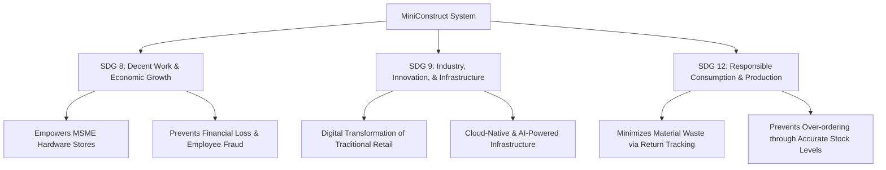

# MiniConstruct System: Panel Presentation & Defense Guide

This guide compiles all necessary materials, structural outlines, academic justifications, and a presentation script for your panel defense of the **MiniConstruct System**. It aligns the technical architecture with local realities in the Philippines and global standards like the United Nations Sustainable Development Goals (SDGs).

---

## 1. Project Overview & Context

### The Philippine Small Construction Store ("Hardware-an") Situation

In the Philippines, micro, small, and medium enterprises (MSMEs) constitute over 99% of registered businesses. Among these, local construction supply stores—informally known as _hardwares_—serve as the primary supply chain nodes for residential construction, community infrastructure, and small-scale contracting.

Unlike general retail (boutiques, grocery stores), construction supply retail has distinct operational characteristics:

- **Diverse Units of Measure:** Selling items by bags (cement), pieces (hollow blocks, steel bars), meters (electrical wires), or rolls (hoses).
- **The "Over-Purchasing" Phenomenon:** Due to the unpredictable nature of construction work, contractors and homeowners typically purchase materials in excess to avoid labor downtime. Consequently, **material returns and refunds are an exceptionally frequent, daily occurrence**.
- **Manual Tracking & Financial Leakage:** The majority of neighborhood hardware stores operate using paper-based logbooks (_listahan_) or basic, non-real-time spreadsheets. This manual approach leads to:
  - **Inventory Shrinkage:** High rate of unaccounted stock due to employee theft, lost records, or unrecorded sales.
  - **Return Mismatches:** Accepting returned materials that were not originally purchased at the store, or refunding incorrect amounts.
  - **Inability to Scale:** Store owners struggle to monitor operations remotely, leaving them dependent on physical presence to verify transactions.

### The Solution: MiniConstruct System

The **MiniConstruct System** is a web-based construction inventory, sales, and return management platform. It is designed to bridge the digital gap for small-scale construction retailers by providing enterprise-grade database integrity, real-time synchronization, strict role-based access control, and an integrated AI assistant, all run on a cost-effective, cloud-native architecture.

---

## 2. Alignment with United Nations Sustainable Development Goals (SDGs)

Aligning your system with the UN SDGs provides strong academic and social justification for your project during the panel review.



### SDG 8: Decent Work and Economic Growth

- **Target 8.3 (Support MSME Growth):** By providing small, family-owned hardware stores with affordable, robust management software, the system enhances their operational efficiency, survival rate, and competitiveness against massive hardware conglomerates.
- **Target 8.8 (Secure Work Environments):** The system's multi-user auditing and Role-Based Access Control (RBAC) protect both the owner's capital and the staff's accountability, promoting a transparent, professional, and secure working environment.

### SDG 9: Industry, Innovation, and Infrastructure

- **Target 9.b (Domestic Technology Development):** MiniConstruct represents local technological innovation tailored to the specific workflows of the Philippine retail landscape. It utilizes modern technologies (React, Vite, Supabase, Serverless Edge Functions, AI) to upgrade the technological capabilities of small-scale industrial suppliers.

### SDG 12: Responsible Consumption and Production

- **Target 12.5 (Reduce Waste Generation):** Construction material production (specifically cement and steel) is highly carbon-intensive. The system’s specialized **Sales Returns Ledger** ensures that excess, unused materials returned by contractors are immediately and accurately reintegrated into active inventory instead of deteriorating, being discarded, or ending up in landfills.
- **Target 12.8 (Information & Awareness):** Real-time stock alerts prevent over-ordering by store managers, ensuring that local supply chains maintain optimal inventory levels, reducing resource stagnation.

---

## 3. Benchmarking against Standard Systems in the Philippines

This table benchmarks the **MiniConstruct System** against the current standard methods utilized by small-to-medium construction stores in the Philippines.

| Feature / Metric                 | Manual Logbooks (_Listahan_)                           | Spreadsheets (Excel / Sheets)                             | Generic Retail POS (e.g., Utak, Peddlr)                  | **MiniConstruct System**                                                                     |
| :------------------------------- | :----------------------------------------------------- | :-------------------------------------------------------- | :------------------------------------------------------- | :------------------------------------------------------------------------------------------- |
| **Primary Target Market**        | Micro-stores / Sari-sari                               | General small businesses                                  | Food & Beverage / Boutiques                              | **Small-to-Medium Construction Supply Stores**                                               |
| **Construction Return Workflow** | Manual adjustment; highly prone to calculation errors. | Manual sheet updates; no verification of purchase.        | Often unsupported or requires tedious, manual overrides. | **Automated & Transaction-Linked; database triggers restore stock instantly.**               |
| **Data Synchronization**         | None (Physical book).                                  | Delayed (Requires manual saving/uploading).               | Standard cloud sync (often delayed or paid tier).        | **Real-time (< 2.0s) multi-terminal sync via Supabase Realtime.**                            |
| **Access Control & Security**    | None; physical theft or alteration is easy.            | Very weak; sheet files can be copied, deleted, or edited. | Standard application-level login.                        | **Database-enforced Row Level Security (RLS) & privilege escalation triggers.**              |
| **Data Querying & Analytics**    | Manual counting at the end of the month.               | Standard graphs; requires formula knowledge.              | Fixed, pre-defined PDF/CSV reports.                      | **Conversational AI Assistant (natural language querying of live DB) + Periodical Reports.** |
| **Cost of Ownership**            | Extremely low (cost of paper).                         | Low (software license/free).                              | Monthly subscription fees; hardware lock-in.             | **High-efficiency, cloud-native (free/extremely low-cost tier hosting).**                    |

---

## 4. The Technical Edge: Why MiniConstruct is Superior

Your presentation must emphasize that MiniConstruct is not just another basic CRUD application. It has specific, advanced architectural features that provide a distinct competitive edge:

### A. Transaction-Linked Return and Restock Automation

- **The Mechanism:** Unlike generic systems, returns in MiniConstruct are strictly bound to a parent transaction ID (`RTN-YYYYMMDD-XXXX` linked to `TXN-YYYYMMDD-XXXX`).
- **Database Constraints:** The system validates that the returning quantity does not exceed the remaining returnable balance (original quantity minus previous returns).
- **Atomic Triggers:** Upon saving a return, a PostgreSQL trigger (`trg_restore_inventory`) automatically increments the `stock_quantity` of the product, and updates the parent transaction status (`partially_returned` or `fully_returned`) within a single database transaction. If any step fails, the entire operation rolls back, ensuring absolute data consistency.

### B. Natural Language Database Querying via AI

- **The Mechanism:** Integrated with a secure, serverless Supabase Edge Function (`inventory-assistant`), the system uses a streaming AI assistant to query live database views (products, categories, transactions, returns).
- **The Value:** Small hardware store owners in the Philippines may not be proficient in analyzing complex data tables or spreadsheets. With the AI assistant, an owner can type or ask: _"Aling mga produkto ang paubos na ang stock?"_ or _"Magkano ang kabuuang benta natin ngayong linggo?"_ and receive immediate, context-aware, streaming analytical summaries.

### C. Database-Level Security (Row Level Security - RLS)

- **The Mechanism:** Security is not merely enforced on the frontend (which can be bypassed by inspecting network requests or using API tools). Every single table in MiniConstruct has PostgreSQL **Row Level Security (RLS)** enabled.
- **Role-Based Constraints:**
  - `staff` profiles are restricted at the database level from executing write operations (INSERT, UPDATE, DELETE) on the `products`, `categories`, `audit_logs`, and `historical_reports` tables.
  - A custom security trigger (`prevent_privilege_escalation`) intercepts all profile updates. If a staff member attempts to modify their own role to `admin`/`owner` or toggle their `is_active` status, the database automatically rejects the transaction.

---

## 5. Presentation Slide-by-Slide Outline

Use this structural outline to design your presentation slides.

```
[Slide 1: Title] ➔ [Slide 2: Background] ➔ [Slide 3: Problem Statement] ➔ [Slide 4: Solution] ➔ [Slide 5: Architecture]
       │
       ▼
[Slide 6: Tech Edge] ➔ [Slide 7: Benchmarking] ➔ [Slide 8: SDG Alignment] ➔ [Slide 9: Demo] ➔ [Slide 10: Conclusion]
```

- **Slide 1: Title Slide**
  - _Title:_ MiniConstruct System: A Modern Inventory, POS, and Return Management Platform for Small-Scale Construction Supply Retailers
  - _Subtitle:_ Empowering Local MSMEs through Cloud-Native Architecture, Automated Restocking, and Context-Aware AI Assist
  - _Presenter:_ [Your Name]
- **Slide 2: Project Background & Motivation**
  - _Key Points:_ The role of local hardware stores in Philippine community development; their reliance on manual workflows; the operational complexity of construction retail.
- **Slide 3: Problem Statement**
  - _Key Points:_ High frequency of material returns; inventory shrinkage and financial leakage; the technological gap between micro-retailers and large hardware conglomerates.
- **Slide 4: The Proposed Solution**
  - _Key Points:_ The MiniConstruct System—a secure, real-time, responsive web application combining POS, automated returns, and business intelligence.
- **Slide 5: System Architecture**
  - _Key Points:_ Diagram showing React/Vite/TypeScript frontend ➔ Supabase Auth & Realtime ➔ PostgreSQL Database (with triggers and RLS) ➔ Serverless Edge Functions (AI & Reports).
- **Slide 6: Technical Edge & Core Features**
  - _Key Points:_ Automated transaction-linked returns; database-enforced Role-Based Access Control (RBAC) & RLS; streaming AI conversational assistant.
- **Slide 7: Benchmarking Comparison**
  - _Key Points:_ Comparison table showing how MiniConstruct outperforms manual logbooks, spreadsheets, and generic commercial POS systems.
- **Slide 8: SDG Alignment**
  - _Key Points:_ Mapping the system's impact to SDG 8 (Decent Work & Economic Growth), SDG 9 (Industry & Innovation), and SDG 12 (Responsible Consumption & Production).
- **Slide 9: System Demonstration (Video / Live Walkthrough)**
  - _Key Points:_ Brief walkthrough of: POS checkout, processing a partial return (showing automatic stock restoration), and asking the AI assistant for a sales report.
- **Slide 10: Conclusion & Future Scope**
  - _Key Points:_ Summary of achievements (efficiency, security, accessibility); future integrations (offline-first sync for remote areas, automated supplier ordering).

---

## 6. Presentation Script (Speech)

This script is written in a professional, academic, yet engaging tone suitable for a Philippine thesis/capstone panel defense.

---

### Slide 1: Title Slide

> "Good morning, respected members of the panel, our adviser, and everyone present today. I am [Your Name], and I am proud to present my capstone project entitled, **'MiniConstruct System: A Modern Inventory, POS, and Return Management Platform for Small-Scale Construction Supply Retailers.'** This system aims to revolutionize how local construction stores manage their daily transactions, inventory movements, and business decisions through modern, cloud-native technologies."

### Slide 2: Project Background & Motivation

> "In the Philippines, neighborhood construction supply stores, or what we locally call _hardwares_, are the unsung heroes of community development. Whenever a family builds a house, repairs a roof, or a local contractor undertakes a municipal project, they rely on these local stores. However, despite their critical role, the vast majority of these businesses still operate using manual paper logbooks or basic, offline spreadsheets. This technological gap leaves them highly vulnerable to operational inefficiencies, stockouts, and financial discrepancies."

### Slide 3: Problem Statement

> "Through our research, we identified three major pain points in local construction retail. First, **the high frequency of material returns**. In construction, over-purchasing is common. Managing these returns manually is a logistical nightmare—checking if the item was actually bought, ensuring the return quantity doesn't exceed the purchase, and manually updating the stock ledger. Second, **inventory shrinkage**—unaccounted losses due to lack of real-time tracking or employee unauthorized modifications. Third, **the lack of accessible analytics**. Store owners, who are often busy or away, cannot easily understand their sales trends or low-stock statuses without spending hours auditing papers."

### Slide 4: The Proposed Solution

> "To address these challenges, we developed the **MiniConstruct System**. It is a secure, real-time, responsive web-based platform that integrates a Point of Sale register, an automated inventory tracker, a specialized transaction-linked sales return ledger, and an interactive, conversational AI assistant. It provides small hardware stores with the enterprise-grade features of large retail chains, but at a fraction of the cost, running on a highly optimized cloud infrastructure."

### Slide 5: System Architecture

> "Let us look at the technical architecture of the system. The frontend is built using **React, Vite, and TypeScript**, styled with **Tailwind CSS** for a fully responsive, modern dark-mode-leaning interface. The backend is powered by **Supabase**. We leverage Supabase Auth for secure JWT-based sessions, and the PostgreSQL database for data persistence. Crucially, instead of relying on the client side to handle data logic, we implemented **PostgreSQL Database Triggers** to automate inventory deduction during checkout and stock restoration during returns. Complex, heavy processes, such as staff creation, report compilation, and the AI engine, are offloaded to horizontal-scaling, serverless **Supabase Edge Functions**."

### Slide 6: Technical Edge & Core Features

> "What sets MiniConstruct apart from standard applications? First is our **Automated Return and Restock System**. When a return is processed, the system validates it against the parent transaction. A database trigger immediately restores the returned materials back to the active inventory and updates the transaction status. Second is **Database-Level Security**. We have enabled Row Level Security on all tables. Even if a user attempts to bypass the UI, the database itself blocks unauthorized reads or writes based on their role. Third is our **Conversational AI Assistant**. By integrating Server-Sent Events, owners can query their database in plain English or Tagalog, receiving instant, streaming, data-driven answers."

### Slide 7: Benchmarking Comparison

> "When benchmarked against existing solutions in the Philippines, MiniConstruct fills a crucial gap. Traditional logbooks are highly insecure and prone to errors. Spreadsheets lack real-time synchronization and multi-user access control. Generic commercial POS systems are often expensive, closed-source, and do not accommodate the unique, high-frequency return workflows of construction materials. MiniConstruct provides a construction-specific, real-time, highly secure, and cost-effective alternative."

### Slide 8: SDG Alignment

> "Furthermore, our project is firmly aligned with the United Nations Sustainable Development Goals. It supports **SDG 8: Decent Work and Economic Growth** by protecting local MSMEs from financial losses and promoting transparent staff accountability. It aligns with **SDG 9: Industry, Innovation, and Infrastructure** by introducing digital innovation to a traditional retail sector. Lastly, it supports **SDG 12: Responsible Consumption and Production** by optimizing inventory levels to prevent material deterioration and establishing a seamless return system that reintegrates surplus construction materials back into the active economy."

### Slide 9: System Demonstration

> "I will now demonstrate the system in action. _[Walk through the live demo: 1. Log in as staff, perform a POS checkout. 2. Show that inventory was deducted. 3. Process a partial return for that transaction, showing the return number RTN-xxxx, and verify that stock was instantly restored. 4. Log in as Admin/Owner, open the AI Assistant, and type: 'Which items are running low on stock?' to show the streaming response. 5. Show the generated historical report with interactive charts.]_"

### Slide 10: Conclusion & Future Scope

> "In conclusion, the MiniConstruct System successfully addresses the operational headaches of small-scale construction retailers in the Philippines. By moving from manual paper logs to a secure, real-time, AI-assisted platform, store owners can protect their inventory, automate complex returns, and make informed business decisions. For future scope, we plan to implement offline-first synchronization to support hardware stores in remote provinces with unstable internet connections, and integrate automated supplier ordering. Thank you very much, and I am now ready to answer your questions."

---

## 8. Panel Q&A Preparation (Anticipated Questions & Strategic Answers)

Be prepared for technical, operational, and conceptual questioning. Here are 10 highly probable questions from Filipino panelists and how to answer them strategically.

### Q1: Why did you choose to build a system specifically for construction stores? Why not just a generic POS system?

- **Strategic Answer:**
  > "Generic POS systems are designed for general retail, where returns are rare and units of measure are standard (usually just 'pieces'). In construction retail, the workflow is fundamentally different. Contractors buy in bulk and frequently return unused, over-purchased items (like cement, pipes, or tiles) at the end of a project phase. Managing these high-frequency returns while validating that the items were actually purchased, calculating the exact refund, and updating inventory is a complex, error-prone process. MiniConstruct was built from the ground up with a transaction-linked, trigger-automated returns ledger specifically to solve this industry-specific problem, which generic POS systems do not handle natively."

### Q2: You mentioned PostgreSQL Triggers for inventory adjustments. Why put this logic in database triggers instead of handling it in the React frontend code?

- **Strategic Answer:**
  > "Handling inventory calculations in the frontend is a severe security and reliability risk. If a user’s browser crashes, or if there is a network interruption mid-transaction, the frontend might fail to send the second request to update the stock, leading to data inconsistency. Furthermore, anyone with basic technical knowledge could bypass the frontend code and send malicious requests directly to our database API. By putting this logic in database triggers (`trg_deduct_inventory` and `trg_restore_inventory`), we ensure **data atomicity**. The database guarantees that the checkout and the inventory deduction succeed together, or fail together (rollback). It also ensures that no matter how the database is accessed, the business rules are securely enforced at the lowest level."

### Q3: What is your database security model? How do you prevent a staff member from modifying their role to 'admin' or 'owner'?

- **Strategic Answer:**
  > "We implement a strict **database-enforced security model** using Supabase and PostgreSQL. First, we enable **Row Level Security (RLS)** on all tables, which means the database itself checks the user’s authenticated role before allowing any operation. Staff members are blocked from writing to critical tables. Second, to prevent privilege escalation, we created a custom database trigger named `prevent_privilege_escalation` on the `profiles` table. If a user attempts to update their own role or toggle their `is_active` status, the trigger automatically raises an exception and rolls back the transaction. The only way a user's role can be changed is if the request is executed by an authorized Admin or Owner, or via a secure, serverless Edge Function that verifies credentials."

### Q4: How does the AI Assistant query the database? Does it have direct write access? Is there a risk of SQL injection or data leaks?

- **Strategic Answer:**
  > "The AI Assistant does **not** have direct write access, nor does it write or execute raw SQL queries on the live database. Instead, it communicates with a secure, serverless Supabase Edge Function (`inventory-assistant`). The Edge Function acts as a mediator: it fetches read-only, aggregated views of the database (such as active products, categories, low-stock counts, and anonymized sales summaries) and feeds this context to the AI model. The AI then processes this data and returns a natural language response. Since the AI is restricted to read-only views and cannot execute arbitrary SQL commands, there is zero risk of SQL injection, data alteration, or unauthorized data access."

### Q5: Philippine internet connectivity can be unstable, especially in rural areas. What happens to the MiniConstruct System if the store loses its internet connection?

- **Strategic Answer:**
  > "As a cloud-native web application, MiniConstruct currently requires an active internet connection to synchronize with the Supabase database. To mitigate connection drops, the system implements **graceful error handling** using React-Query. If a request fails, the system displays a clear toast notification and prevents data loss. For our future scope, we plan to implement an offline-first architecture using a local database sync (such as IndexedDB or RxDB) that will allow the staff to continue recording checkouts offline, and automatically sync the transactions to the cloud once the connection is restored."

### Q6: How does the system handle "Low Stock Alerts"? Is it a fixed threshold for all products?

- **Strategic Answer:**
  > "No, the system does not use a fixed threshold because different construction materials have different turnover rates and packaging sizes. For example, 10 bags of cement is considered critically low, while 10 pieces of electrical screws is plenty. Therefore, each product has a customizable `reorder_level` field in the database. The system dynamically compares the current `stock_quantity` with that product's specific `reorder_level`. If the stock falls below or equals this level, a prominent visual warning badge is displayed in real-time in the inventory grid and on the admin dashboard."

### Q7: Explain the structure of your Transaction and Return numbers. Why is it formatted as YYYYMMDD-XXXX?

- **Strategic Answer:**
  > "Our transaction numbers follow the structure `TXN-YYYYMMDD-XXXX`, and return numbers follow `RTN-YYYYMMDD-XXXX`. The `YYYYMMDD` represents the transaction date in the Asia/Manila time zone, and the `XXXX` is a daily-resetting, zero-padded sequential counter. This format is highly advantageous for Philippine businesses: it allows managers to immediately identify the exact date of a transaction just by looking at the receipt, makes manual filing easy, and prevents receipt duplication. It is enforced at the database level to guarantee uniqueness."

### Q8: What if a staff member processes a return for items that were never purchased, or returns more than what was bought?

- **Strategic Answer:**
  > "The system has strict **quantity and referential integrity validation** built into the return workflow. When a return is initiated, it must be linked to a valid transaction ID. The system retrieves the exact list and quantities of items purchased in that transaction. The database enforces a rule where the returning quantity of a product cannot exceed the original purchased quantity, minus any quantities that have already been returned in the past. This prevents employees from committing fraud by processing fake returns or returning more stock than was actually sold."

### Q9: How does the Historical Reports generation work? Why is it processed in the background?

- **Strategic Answer:**
  > "Generating comprehensive reports (daily, weekly, monthly, yearly) requires aggregating large datasets—summing revenues, counting transactions, analyzing inventory movements, and compiling audit logs. If we ran these heavy queries synchronously in the user's browser, it could cause the browser tab to freeze, or time out on larger datasets. To solve this, report compilation runs asynchronously in a **Supabase Edge Function** (`generate-historical-report`). Once compiled, the report is saved in the database, and the frontend renders it using interactive charts. This ensures a fast, lag-free user experience."

### Q10: If you were to commercialize this system for Philippine hardware stores, how would you handle BIR (Bureau of Internal Revenue) compliance?

- **Strategic Answer:**
  > "To fully commercialize the system in the Philippines as an official POS, it must undergo **BIR accreditation** under the guidelines of Revenue Memorandum Order (RMO) No. 10-2005. MiniConstruct is already architected to support this: we have a strict, non-volatile **Audit Trail** (`audit_logs` table) that logs every single database change with timestamps and user IDs, and we generate unique, sequential transaction numbers. To achieve full compliance, the next step would be integrating a BIR-compliant receipt printer layout that prints the store's TIN, permit number, and the official receipt (OR) details, and locking the database against any historical transaction deletions."
