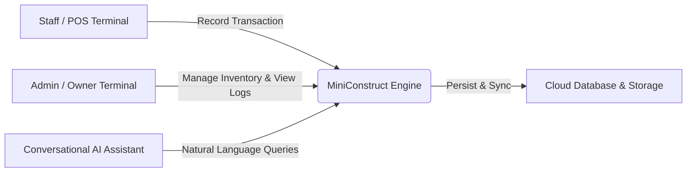

# MiniConstruct System: System Overview, Problems Solved, and Emerging Technologies

This document provides a technical overview of the **MiniConstruct System**, details the specific operational problems it solves, and highlights the emerging technologies utilized in its architecture.

---

## 1. System Overview

The **MiniConstruct System** is an integrated, secure, and real-time inventory, Point of Sale (POS), and return management platform designed specifically for small-to-medium construction supply stores (*hardwares*) in the Philippines. It bridges the gap between storefront sales transactions and back-office management, offering a lightweight, cost-effective alternative to expensive Enterprise Resource Planning (ERP) software.



### Core System Features
*   **Point of Sale (POS) Register:** A digital cart system supporting rapid product searching, category filtering, and checkout. It automatically generates unique transaction numbers formatted as `TXN-YYYYMMDD-XXXX` (using the Asia/Manila time zone).
*   **Automated Sales Return Ledger:** A specialized interface to process full or partial returns. Returns are strictly linked to their parent transaction, ensuring that returned quantities and prices are validated against the original purchase. It generates return numbers formatted as `RTN-YYYYMMDD-XXXX`.
*   **Real-Time Inventory Tracker:** Live stock monitoring that displays warnings when a product's stock quantity falls below its custom reorder level.
*   **Asynchronous Historical Reporting:** Aggregates transactions, inventory movements, user activities, and audit summaries into daily, weekly, monthly, or yearly reports.
*   **Privileged Audit Logging:** A secure log of all critical database modifications, capturing before-and-after states in structured JSONB format for security reviews.

---

## 2. The Concrete Problems Solved

Traditional hardware retail operations rely heavily on manual paper-based books (*listahan*) or basic spreadsheets. MiniConstruct solves five critical operational problems:

### A. The Construction Material Return Logjam
*   **The Problem:** Construction projects regularly experience material over-purchasing (e.g., buying extra cement bags, steel bars, or pipes to avoid labor delays). Consequently, hardware stores face a high volume of daily returns and exchange requests. Manually validating whether the returned items were actually purchased at the store, checking the original price, ensuring the return quantity does not exceed the purchase, and manual restocking are highly prone to calculation errors and fraudulent returns.
*   **The Solution:** MiniConstruct enforces a transaction-linked return workflow. The system validates the input against the parent transaction database record, calculates the exact refund amount (`quantity * purchase_unit_price`), and automatically restores the stock levels via database-level triggers, eliminating manual record adjustments.

### B. Inventory Shrinkage and Lack of Real-Time Control
*   **The Problem:** Without a centralized, real-time system, store owners suffer from inventory shrinkage (stock loss due to theft, damage, or unrecorded sales). Furthermore, double-selling occurs when two terminals sell the same stock simultaneously without instant updates.
*   **The Solution:** The system integrates real-time database replication. Any stock change from a POS checkout or return is broadcast to all active screens in less than 2.0 seconds.

### C. Vulnerability to Insider Fraud and Price Manipulation
*   **The Problem:** Paper logs and spreadsheets can be easily altered, deleted, or falsified by staff members to hide cash discrepancies, alter product prices, or apply unauthorized discounts.
*   **The Solution:** MiniConstruct implements a strict 3-role hierarchy (`owner`, `admin`, `staff`) backed by database-level constraints. Every critical transaction, price change, or account status alteration is permanently written to a read-only audit log with before-and-after snapshots in JSONB format.

### D. Operational Bottlenecks for Remote Owners
*   **The Problem:** Store owners in the Philippines often manage multiple businesses or travel frequently, leaving them unable to monitor daily sales, check low-stock items, or audit staff actions without physically visiting the store.
*   **The Solution:** The cloud-hosted database and web-based interface allow owners to securely log in from any location (via desktop, laptop, or mobile device) to monitor real-time sales metrics, view audit logs, and run reports.

### E. Manual Bookkeeping and Aggregation Errors
*   **The Problem:** Compiling monthly sales tax reports, calculating revenues, and tracking overall inventory movement manually from paper logs takes days of tedious work and is highly susceptible to mathematical errors.
*   **The Solution:** The system aggregates metrics asynchronously in the cloud, generating clear, interactive reports with charts showing sales trends, category distributions, and inventory fluctuations over selected periods.

---

## 3. Emerging Technologies in the MiniConstruct System

The system integrates five emerging architectural patterns and technologies to deliver high performance, security, and accessibility at a low operational cost:

```
┌─────────────────────────────────────────────────────────────────────────┐
│                           React Single Page Application                 │
│   (Vite, TypeScript, Tailwind CSS, Real-time WebSockets Client)         │
└────────────────────────────────────┬────────────────────────────────────┘
                                     │ HTTPS / WSS
                                     ▼
┌─────────────────────────────────────────────────────────────────────────┐
│                     Supabase BaaS (Backend-as-a-Service)                │
│                                                                         │
│  ┌──────────────────────┐  ┌─────────────────────┐  ┌────────────────┐  │
│  │   PostgreSQL DB      │  │    Edge Functions   │  │  Supabase Auth │  │
│  │  - Row Level Security│  │  - AI Assistant     │  │  - JWT Claims  │  │
│  │  - Database Triggers │  │  - Async Reports    │  │  - RLS Checks  │  │
│  └──────────────────────┘  └─────────────────────┘  └────────────────┘  │
└─────────────────────────────────────────────────────────────────────────┘
```

### A. Backend-as-a-Service (BaaS) & Serverless Architecture
*   **Technology:** Supabase (built on PostgreSQL, Go, and serverless infrastructure).
*   **Implementation:** Instead of provisioning, maintaining, and paying for a traditional virtual machine or physical server running a heavy backend framework (like Java Spring Boot or .NET), MiniConstruct utilizes serverless BaaS.
*   **Value:** This cloud-native approach drastically reduces hosting fees (allowing the system to run on a free or minimal tier), ensures high availability (99.9% uptime), and scales automatically as transaction volumes grow.

### B. Generative AI & Conversational Business Intelligence (BI)
*   **Technology:** Large Language Models integrated via Server-Sent Events (SSE) stream.
*   **Implementation:** The system features an AI-powered conversational assistant connected directly to read-only views of the live database. When a user asks a question, a secure Supabase Edge Function fetches the relevant database context (stock levels, low stock warnings, sales summaries) and sends it to the AI engine, streaming the response word-by-word back to the user's chat interface.
*   **Value:** It replaces complex SQL querying and rigid report interfaces with Natural Language Querying (NLQ). A store owner can query live data by typing simple questions in English or Tagalog, lowering the technical barrier to accessing business intelligence.

### C. Reactive Real-Time Data Synchronization
*   **Technology:** WebSockets via Supabase Realtime (PostgreSQL Write-Ahead Log replication).
*   **Implementation:** The system subscribes to database changes using a publish-subscribe (pub/sub) pattern. When a transaction is committed, the database broadcasts the updated stock levels and transaction lists to all connected web clients via WebSockets in less than 2.0 seconds.
*   **Value:** It eliminates the need for manual page refreshing or aggressive polling (which degrades performance and wastes bandwidth), providing immediate operational awareness across multiple terminals.

### D. Database-Enforced Row Level Security (RLS)
*   **Technology:** PostgreSQL Row Level Security (RLS) and JSON Web Tokens (JWT).
*   **Implementation:** Security policies are declared directly on the database tables rather than relying solely on the application code. When a client makes an API request, the database decodes the user's JWT and evaluates the security policies to determine if the user has permission to read or write that specific row.
*   **Value:** It ensures that even if the client-side code is tampered with, or if a malicious actor attempts to access the database APIs directly using external tools, the database will block unauthorized actions, preventing data breaches.

### E. Edge Computing for Heavy Computations
*   **Technology:** Deno Deploy / Supabase Edge Functions.
*   **Implementation:** High-overhead operations—such as creating user credentials securely via admin APIs, processing LLM queries, and generating large historical reports—are isolated into independent, serverless Edge Functions.
*   **Value:** These functions execute geographically close to the user, reducing latency, and run in isolated sandboxes. This prevents heavy report calculations from slowing down the core POS and inventory database operations.
